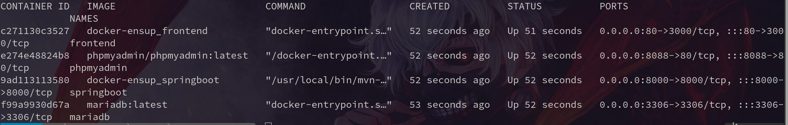

# MyResto

Application web permettant de gérer les commandes des clients dévellopper grâce à [Java Spring Boot](https://laravel.com/docs/9.x) et [ReactJs](https://fr.reactjs.org/docs/getting-started.html)

---

     [](https://opensource.org/licenses/MIT)

---


## :palm_tree: Caractéristiques

| Technology | Description | Front-End | Back-End |
| --- | --- | ---| --- |
| Java Spring Boot | Java Spring Boot (Spring Boot) est un outil JAVA, permettant de rendre le dévelloppement d'application web et de microservice plus rapidement et facilement. | | X |
| React | Framework JavaScript permettant la gestion de l'interface utilisateur | X |  |

---

## :star2: Installation

Avant de lancer les conteneurs Docker, assurez-vous d'avoir une configuration correct :

| Description | Link |
| --- | --- |
| Docker Linux | <https://docs.docker.com/engine/install/ubuntu/> |
| Docker Windows | <https://docs.docker.com/desktop/install/windows-install/> |

<br>

###### Etapes

1. Cloner le dépôt :

```bash
git clone https://gitlab.com/f885/woryu.git
```

2. Aller dans le dossier :

```shell
cd woryu
```

3. Lancer les conteneurs :

```shell
docker-compose up -d
```

3. Check if it's working !!

```shell
docker ps
```



---

## :link: Liens des conteneurs

| Container  | Liens |
| --- | --- |
| Laravel App (Local) | <http://localhost> |
| PhpMyAdmin (Local) | <http://localhost:8080> |

---


## :kimono: Contributeurs
> In progress
<!-- ALL-CONTRIBUTORS-LIST:START - Do not remove or modify this section -->
<!-- prettier-ignore-start -->
<!-- markdownlint-disable -->
<!-- <table>
  <tbody>
    <tr>
      <td align="center"><a href="https://kentcdodds.com"><br /><sub><b>Kent C. Dodds</b></sub></a><br /><a href="#question-kentcdodds" title="Answering Questions">💬</a> <a href="https://github.com/all-contributors/all-contributors/commits?author=kentcdodds" title="Documentation">📖</a> <a href="https://github.com/all-contributors/all-contributors/pulls?q=is%3Apr+reviewed-by%3Akentcdodds" title="Reviewed Pull Requests">👀</a> <a href="#talk-kentcdodds" title="Talks">📢</a></td>
      <td align="center"><a href="https://github.com/jfmengels"><br /><sub><b>Jeroen Engels</b></sub></a><br /><a href="https://github.com/all-contributors/all-contributors/commits?author=jfmengels" title="Documentation">📖</a> <a href="https://github.com/all-contributors/all-contributors/pulls?q=is%3Apr+reviewed-by%3Ajfmengels" title="Reviewed Pull Requests">👀</a> <a href="#tool-jfmengels" title="Tools">🔧</a></td>
    </tr>
    
  </tbody>
</table> -->

<!-- markdownlint-restore -->
<!-- prettier-ignore-end -->

<!-- ALL-CONTRIBUTORS-LIST:END -->

---

## :pencil: License

[](https://opensource.org/licenses/MIT)